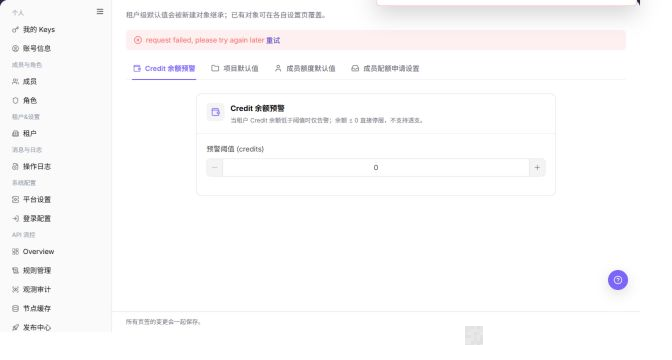

# 租户设置

## 功能概述

| 项目 | 内容 |
| --- | --- |
| 适用角色 | 模型调用方 |
| 导航路径 | 设置 > 租户&设置 > 租户设置 |
| 页面路由 | `/user/user-space/settings` |
| 管理对象 | Credit 余额预警、项目默认值、成员额度策略和租户级默认规则 |

#### 新手理解

租户设置页像租户默认规则面板，用来设置新项目、新成员或额度申请的默认策略。改动后通常影响后续创建对象，已有对象仍需在各自页面单独核对。

#### 术语速查

| 术语 | 英文 | 说明 |
| --- | --- | --- |
| 租户设置 | Term | 租户级默认配置入口。；改动前确认适用范围。 |
| 默认规则 | Term | 新对象创建时继承的规则。；不一定影响已有对象。 |
| 租户上下文 | Term | 当前设置所属租户。；跨租户前先确认。 |
| 成员默认策略 | Term | 新成员加入后的初始规则。；变更后验证新成员。 |

## 前提条件

1. 当前账号具备租户设置查看和维护权限。
2. 保存设置前已确认对项目、成员额度和额度申请流程的影响。
3. 重置默认值前已确认当前配置可以被覆盖。

## 页面说明

| 页签 | 说明 |
| --- | --- |
| Credit 余额预警 | 配置租户余额低于阈值时的告警规则 |
| 项目默认值 | 配置新项目默认重置周期、预警阈值和限额策略 |
| 成员额度默认值 | 配置新成员初始额度、重置周期和限额策略 |
| 额度申请设置 | 配置待审批申请自动过期时间和申请规则 |
| 底部按钮 | 重置为默认值、保存设置 |

截图保留左侧导航和完整功能区，顶部菜单已隐藏；请重点查看租户设置页面的字段、按钮和操作位置。

## 主要操作

### 查看租户设置

1. 进入 `设置 > 租户&设置 > 租户设置`。
2. 查看组织基础信息、额度申请设置、项目默认值和成员额度默认值。
3. 记录当前状态并确认各项配置适用于当前租户。
4. 信息缺失时刷新页面并检查管理权限；截图或外发前隐藏组织标识和额度。

截图保留左侧导航和完整功能区，顶部菜单已隐藏；请重点查看租户设置页面的字段、按钮和操作位置。

**结果校验：** 列表、详情和状态字段能够显示目标对象，且信息相互一致。

**注意事项：** 只使用当前页面实际展示的字段和入口，不根据其他角色页面推断能力。

**常见问题：** 如果入口不可见、按钮置灰或结果未更新，先检查当前账号权限、筛选条件、对象状态和页面刷新时间。

### 编辑租户设置

1. 进入 `租户&设置 > 租户设置`。
2. 在 `Credit 余额预警` 页签设置预警阈值。

下图展示租户设置的余额预警页签。

3. 切换到 `项目默认值`，设置新项目的重置周期、预警阈值和限额策略。

下图展示项目默认值页签。

4. 切换到 `成员额度默认值`，设置新成员默认授权额度、重置周期和限额策略。

下图展示成员额度默认值页签。

5. 切换到 `额度申请设置`，设置待审批申请自动过期时间。

下图展示额度申请设置页签。

6. 确认所有页签配置后，再单击 **"保存设置"**。

**结果校验：** 按页面成功提示，并回到列表或详情核对对象状态、更新时间和影响范围。

**注意事项：** 提交前再次核对目标对象和影响范围；涉及权限、状态、数据或外部配置时，先确认审批和回退方式。

**常见问题：** 如果入口不可见、按钮置灰或结果未更新，先检查当前账号权限、筛选条件、对象状态和页面刷新时间。

### 核验租户设置

1. 完成获批修改后重新打开租户设置。
2. 对照修改记录核对开关、默认值和更新时间。
3. 使用新建项目或成员前先确认默认值是否按预期生效。
4. 未生效时检查保存提示、权限和缓存；不要连续重复提交。

截图保留左侧导航和完整功能区，顶部菜单已隐藏；请重点查看租户设置页面的字段、按钮和操作位置。

**结果校验：** 列表、详情和状态字段能够显示目标对象，且信息相互一致。

**注意事项：** 只使用当前页面实际展示的字段和入口，不根据其他角色页面推断能力。

**常见问题：** 如果入口不可见、按钮置灰或结果未更新，先检查当前账号权限、筛选条件、对象状态和页面刷新时间。

## 参数速查表

| 字段名称 | 是否必填 | 字段类型 | 示例 | 说明 |
| --- | --- | --- | --- | --- |
| 租户名称 | 否 | 文本 | 示例租户 A | 当前配置所属租户。 |
| 默认项目规则 | 否 | 配置 | 启用 | 影响后续创建项目。 |
| 成员默认策略 | 否 | 配置 | 普通成员 | 影响后续新增成员。 |
| 额度规则 | 否 | 配置 | 默认额度 | 影响额度申请或分配。 |
| 保存 | 否 | 按钮 | 保存 | 提交租户设置变更。 |

## 踩坑提示

- 租户设置变更通常影响后续对象，不要默认已有项目和成员会同步变化。
- 保存前确认当前租户上下文，避免改到其他租户。
- 默认额度或成员策略变更后，应创建测试对象验证效果。

## 结果校验

| 检查项 | 成功表现 | 异常时处理 |
| --- | --- | --- |
| 配置已保存 | 保存后页面配置保持为新值 | 重新进入页面确认是否有保存失败提示 |
| 默认规则生效 | 新项目或新成员创建时继承租户默认规则 | 检查租户范围和创建时选择的默认配置 |
| 申请流转正确 | 额度申请按设置的过期时间流转 | 到额度申请页面核对申请状态和时间 |

## 常见问题

#### 保存设置后已有项目未变化

**问题现象：**

租户设置保存后，已有项目或成员仍显示旧配置。

**可能原因：**

- 租户设置主要作为默认值影响后续新建对象。
- 已有项目或成员在详情页有独立配置。

**处理方式：**

1. 进入项目详情或成员额度页单独调整。
2. 新建对象时确认是否继承了最新默认值。

#### 租户设置为什么没有加载配置？

**问题现象：**

租户设置页没有默认额度、申请过期时间或项目默认规则。

**可能原因：**

当前账号不具备租户设置权限，租户未初始化默认设置，或页面仍展示其他租户的数据。

**处理方式：**

先确认当前租户；再检查租户设置权限；如配置确实为空，由租户负责人按默认规则补齐后保存。
#### 为什么租户设置保存按钮不可用？

**问题现象：**

租户设置项可见，但保存、重置或修改默认规则的按钮不可点击。

**可能原因：**

当前账号不具备租户设置权限，租户策略由上级平台托管，或配置项正在审批中。

**处理方式：**

确认租户设置权限和配置来源；托管配置由平台运营方调整，审批中的配置等待流程结束后再修改。

#### 如何安全导出或截图租户设置页面？

**问题现象：**

需要把页面信息用于排障、审计或交付。

**可能原因：**

页面可能包含账号、邮箱、IP、内部路径、租户标识、Key 或金额等敏感信息。

**处理方式：**

只保留必要字段和操作上下文，使用浅灰小颗粒马赛克覆盖敏感文字，不外发完整凭证或内部地址。

#### 租户设置页面出现异常数据怎么办？

**问题现象：**

字段、状态、统计或关联对象与预期不一致。

**可能原因：**

页面范围、时间条件、角色权限或上游配置不一致。

**处理方式：**

记录脱敏后的对象、时间和结果，先核对页面入口及筛选条件，再查看关联页面和操作日志。

## 注意事项

- 保存设置会影响后续租户管理流程，执行前应确认配置含义。
- `重置为默认值` 会覆盖当前页面配置，执行前应确认是否需要保留原值。

## 后续操作

1. 创建新项目验证项目默认值。
2. 添加新成员验证成员额度默认值。
3. 在额度申请页查看申请规则是否符合预期。
