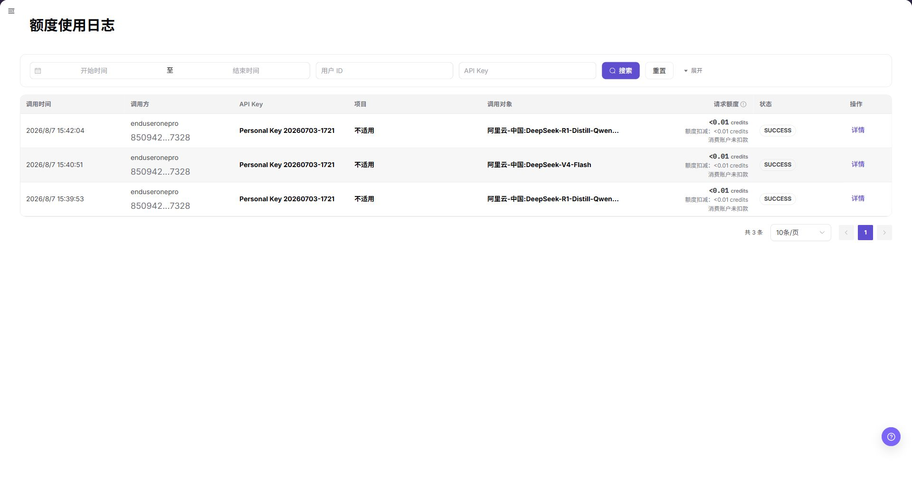
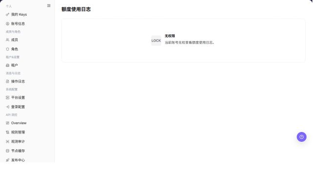

# 额度使用日志

## 功能概述

| 项目 | 内容 |
| --- | --- |
| 适用角色 | 模型调用方 |
| 导航路径 | 设置 > 租户&设置 > 额度使用日志 |
| 页面路由 | `/user/user-space/usage-log` |
| 管理对象 | 额度使用事件及其只读详情 |

#### 新手理解

先确认页面对象，再按页面上的入口完成查看或变更，并在结果区域核对状态。

#### 术语速查

| 术语 | 英文 | 说明 |
| --- | --- | --- |
| 额度使用日志 | Term | 用于识别额度使用日志页面中的目标对象。 |
| 状态 | Status | 表示对象当前是否可用或已生效。 |
| 操作入口 | Action entry | 页面提供的按钮、行内操作或详情入口。 |

## 前提条件

1. 当前终端用户账号可以在设置菜单中看到 `额度使用日志` 入口。
2. 账号至少有一条可见额度使用事件，或需要验证空列表状态。
3. 不要复制或记录真实 API Key、调用方标识、项目名、主题和请求详情。

## 页面说明

筛选区提供 `开始时间`、`结束时间`、`用户 ID` 和 `API Key` 字段，并提供 `搜索`、`重置` 和 `展开` 控件。

表格包含：

| 字段 | 说明 |
| --- | --- |
| Event Time | 用量事件发生时间。 |
| Caller | 事件对应的调用方标识。 |
| API Key | 与事件关联的脱敏或缩略 Key。 |
| Project | 适用时展示项目上下文。 |
| Subject | 事件对应的模型或请求主题。 |
| Requested Quota | 请求额度和扣减额度信息。 |
| Status | 处理结果，例如 `SUCCESS`。 |
| Actions | `Detail` 打开只读事件信息。 |

截图保留左侧导航和完整功能区，顶部菜单已隐藏；请重点查看额度使用日志页面的字段、按钮和操作位置。

## 主要操作

### 查看额度使用事件

1. 进入 `设置 > 租户&设置 > 额度使用日志`。
2. 选择时间范围，并按成员、项目、资源类型、动作或结果筛选。
3. 核对目标事件的时间、额度变化、对象和原因。
4. 无结果时检查时区并清除组合筛选；额度和成员数据外发前必须脱敏。

截图保留左侧导航和完整功能区，顶部菜单已隐藏；请重点查看额度使用日志页面的字段、按钮和操作位置。

**结果校验：** 列表、详情和状态字段能够显示目标对象，且信息相互一致。

**注意事项：** 只使用当前页面实际展示的字段和入口，不根据其他角色页面推断能力。

**常见问题：** 如果入口不可见、按钮置灰或结果未更新，先检查当前账号权限、筛选条件、对象状态和页面刷新时间。

### 查看额度使用事件详情

1. 点击目标事件的 **"详情"**。
2. 对比变化前额度、变化量、变化后额度和关联对象。
3. 核对同一时间附近是否存在撤销或后续调整。
4. 无法解释时记录脱敏事件 ID 和时间范围后升级，不直接修改额度。

截图保留左侧导航和完整功能区，顶部菜单已隐藏；请重点查看额度使用日志页面的字段、按钮和操作位置。

**结果校验：** 列表、详情和状态字段能够显示目标对象，且信息相互一致。

**注意事项：** 只使用当前页面实际展示的字段和入口，不根据其他角色页面推断能力。

**常见问题：** 如果入口不可见、按钮置灰或结果未更新，先检查当前账号权限、筛选条件、对象状态和页面刷新时间。

## 参数速查表

| 字段名称 | 是否必填 | 字段类型 | 示例 | 说明 |
| --- | --- | --- | --- | --- |
| 目标对象 | 必填 | 文本 | `<OBJECT_ID>` | 用于定位额度使用事件及其只读详情。 |
| 状态 | 系统展示 | 枚举 | `Enabled` | 表示对象当前是否可用或已生效。 |
| 操作入口 | 条件必填 | 按钮 / 菜单 | `查看` | 进入查看、编辑或后续处理流程。 |
| 更新时间 | 系统生成 | 日期时间 | `2026-01-01 00:00` | 用于核对最近一次同步或变更。 |

## 踩坑提示

- 额度使用日志是审计查看页面，打开 `Detail` 不会改变额度或账务状态。
- 脱敏或缩略后的 API Key 仍然属于敏感信息，不要复制到文档或工单。
- 空列表可能由时间范围、账号范围或当前没有用量事件导致。

## 结果校验

| 检查项 | 成功表现 | 异常时处理 |
| --- | --- | --- |
| 页面可进入 | 从可见的设置菜单打开 `额度使用日志`。 | 检查账号权限和菜单是否显示。 |
| 筛选生效 | `搜索` 刷新列表，`重置` 清空条件。 | 清空条件后重新查询。 |
| 事件字段可见 | 能看到事件时间、调用方、API Key、项目、主题、请求额度、状态和操作。 | 确认当前账号是否有可见用量事件。 |
| 详情只读 | `Detail` 打开事件信息，页面没有保存或提交动作。 | 关闭详情并记录受限原因。 |

## 常见问题

#### 为什么列表中看不到目标额度使用日志？

**问题现象：**

进入页面后没有找到目标额度使用日志。

**可能原因：**

筛选条件过窄、租户范围不匹配，或当前账号无权查看该对象。

**处理方式：**

清除筛选条件并重新查询，确认当前租户和角色范围；仍不可见时联系具备相应权限的运营管理员。

#### 为什么额度使用日志操作入口不可用？

**问题现象：**

页面上的按钮不可见、置灰或点击后没有反应。

**可能原因：**

当前账号缺少操作权限，对象处于不允许变更的状态，或页面数据尚未刷新。

**处理方式：**

检查角色权限和对象状态，刷新页面后再按页面提示处理；不要连续重复提交。

#### 额度使用日志变更后为什么没有更新？

**问题现象：**

操作完成后，列表或详情仍显示旧值。

**可能原因：**

缓存或同步存在延迟，操作未真正提交，或查看的不是同一个对象。

**处理方式：**

核对成功提示、对象标识和更新时间，刷新列表并重新打开详情；必要时到操作日志确认记录。

#### 如何安全导出或截图额度使用日志页面？

**问题现象：**

需要把页面信息用于排障、审计或交付。

**可能原因：**

页面可能包含账号、邮箱、IP、内部路径、租户标识、Key 或金额等敏感信息。

**处理方式：**

只保留必要字段和操作上下文，使用浅灰小颗粒马赛克覆盖敏感文字，不外发完整凭证或内部地址。

#### 额度使用日志页面出现异常数据怎么办？

**问题现象：**

字段、状态、统计或关联对象与预期不一致。

**可能原因：**

页面范围、时间条件、角色权限或上游配置不一致。

**处理方式：**

记录脱敏后的对象、时间和结果，先核对页面入口及筛选条件，再查看关联页面和操作日志。

## 注意事项

- 本页面是在 Demo 核查中确认新增到终端用户设置菜单的入口。
- 文档截图已遮挡全部事件记录和身份值，仅保留筛选项和字段标题。

## 后续操作

1. 回到设置 > 租户&设置 > 额度使用日志核对本次操作的状态和更新时间。
2. 如需继续处理关联对象，进入页面提供的下一个业务入口。
