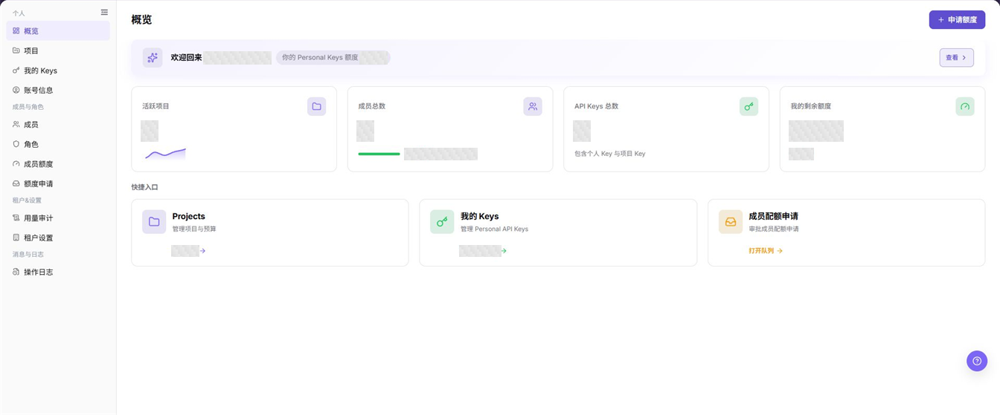
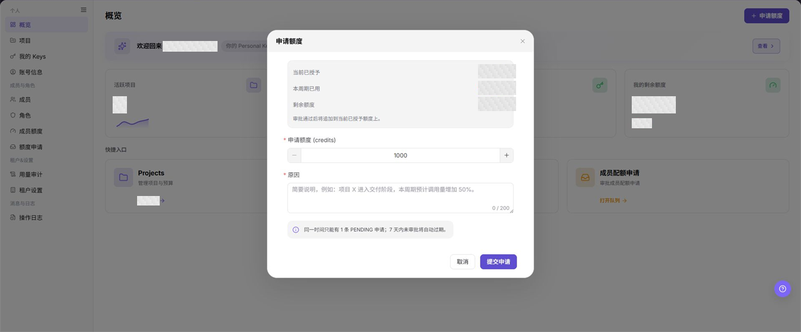

# 概览

## 功能概述

| 项目 | 内容 |
| --- | --- |
| 适用角色 | 模型调用方 |
| 导航路径 | 设置 > 个人 > 概览 |
| 页面路由 | `/user/user-space/workspace/overview` |
| 管理对象 | Personal Keys 额度、项目与成员统计、API Keys 统计和快捷入口 |

#### 新手理解

概览页像个人工作区的状态面板，用于快速确认额度、项目、成员和 API Keys 的当前情况。需要继续处理时，可从快捷入口进入项目、我的 Keys 或成员配额申请页面，也可以直接发起额度申请。

#### 术语速查

| 术语 | 英文 | 说明 |
| --- | --- | --- |
| Personal Keys 额度 | Personal Keys quota | 当前成员使用个人 Key 时可用的额度。 |
| 活跃项目 | Active Projects | 当前成员可见且处于活跃状态的项目数量。 |
| API Keys 总数 | Total API Keys | 当前范围内个人 Key 与项目 Key 的总数。 |
| 成员配额申请 | Member Quota Request | 成员提交并等待审批的额度申请。 |

## 前提条件

1. 当前账号具备概览页的查看权限；快捷入口是否可见以角色授权为准。
2. 发起额度申请前已确认所需额度和申请原因。
3. 根据概览数据处理项目、Key 或成员额度前，已确认当前租户和成员范围。

## 页面说明

概览页顶部显示 Personal Keys 额度和 **"申请额度"** 入口。摘要卡片依次显示活跃项目、成员总数、API Keys 总数和我的剩余额度；快捷入口用于打开项目、我的 Keys 和成员配额申请页面。

上图仅隐藏顶部菜单，保留左侧导航和完整功能区。浅灰马赛克只覆盖账号、额度和统计数值，请重点查看摘要卡片、**"申请额度"** 按钮和三个快捷入口的位置。

## 主要操作

### 查看概览

1. 进入 `设置 > 个人 > 概览`。
2. 在欢迎区域查看 Personal Keys 额度，并确认 **"查看"** 和 **"申请额度"** 是否可见。
3. 依次核对 `活跃项目`、`成员总数`、`API Keys 总数` 和 `我的剩余额度`。
4. 结合卡片说明确认成员启用情况，以及 API Keys 是否同时包含个人 Key 和项目 Key。

上图展示概览摘要和快捷入口。统计值已脱敏，字段名称和卡片顺序与实际页面保持一致。

**结果校验：** 四张摘要卡片均能显示当前统计或额度状态，页面下方显示项目、我的 Keys 和成员配额申请入口。

**注意事项：** 概览数据用于快速判断，不替代项目、Key、成员或额度申请页面中的明细。

**常见问题：** 如果卡片为空或长时间不更新，先确认当前租户和成员范围，再打开对应明细页核对对象状态。

### 申请额度

1. 进入 `设置 > 个人 > 概览`，点击 **"申请额度"**。
2. 在弹窗中查看 `当前已授予`、`本周期已用` 和 `剩余额度`。
3. 在 `申请额度 (credits)` 中填写所需额度，也可以使用增减按钮调整数值。
4. 在 `原因` 中填写不超过 200 个字符的业务说明，不要包含账号、Key、内部地址或客户敏感信息。
5. 确认当前没有其他 `PENDING` 申请后，点击 **"提交申请"**。同一时间只能有一条 `PENDING` 申请，7 天内未审批的申请会自动过期。

上图展示额度摘要、申请额度、原因和提交入口。当前额度值已经脱敏，字段名、默认输入值和状态提示均保留。

**结果校验：** 提交成功后，额度申请页面出现对应记录；审批完成后，概览页额度按审批结果更新。

**注意事项：** 提交前核对额度单位和原因；不要为同一用途重复提交申请。

**常见问题：** 如果无法提交，检查申请额度和原因是否填写、是否已有 `PENDING` 申请，以及当前账号是否具备额度申请权限。

### 打开项目

1. 进入 `设置 > 个人 > 概览`。
2. 在 `快捷入口` 区域找到 `Projects` 卡片。
3. 点击卡片或卡片中的活跃项目入口，进入 `项目` 页面。
4. 在项目页核对项目列表、成员范围和预算信息。

上图左下方的 `Projects` 卡片是项目管理入口，卡片中的数量表示当前活跃项目统计。

**结果校验：** 页面跳转到 `/user/user-space/projects`，左侧导航中的 `项目` 处于选中状态。

**注意事项：** 概览只展示活跃项目数量；项目成员和预算以项目页为准。

**常见问题：** 如果卡片不可用或跳转后列表为空，检查项目查看权限以及当前成员是否已加入项目。

### 打开我的 Keys

1. 进入 `设置 > 个人 > 概览`。
2. 在 `快捷入口` 区域找到 `我的 Keys` 卡片。
3. 点击卡片或个人 Key 数量入口，进入 `我的 Keys` 页面。
4. 在目标页核对个人 Key 与项目 Key 的可见范围；不要在文档、工单或截图中公开完整凭证。

上图中间的 `我的 Keys` 卡片提供个人 Key 管理入口，概览卡片不会展示 Key 的完整值。

**结果校验：** 页面跳转到 `/user/user-space/my-keys`，左侧导航中的 `我的 Keys` 处于选中状态。

**注意事项：** API Keys 总数包含个人 Key 和项目 Key，快捷入口卡片显示的是个人 Key 统计，两者口径不同。

**常见问题：** 如果概览统计与目标页数量不同，先核对 Key 类型、项目范围和页面刷新时间。

### 打开成员配额申请

1. 进入 `设置 > 个人 > 概览`。
2. 在 `快捷入口` 区域找到 `成员配额申请` 卡片。
3. 点击卡片或 **"打开队列"**，进入 `额度申请` 页面。
4. 在目标页查看申请人、申请额度、状态和提交时间，并按当前权限继续处理。

上图右下方的 `成员配额申请` 卡片用于打开申请队列；搜索、筛选和分页属于目标页的辅助动作。

**结果校验：** 页面跳转到 `/user/user-space/quota-requests`，左侧导航中的 `额度申请` 处于选中状态。

**注意事项：** 概览入口只负责打开队列，不代表当前账号一定具备审批或撤回权限。

**常见问题：** 如果队列不可见，检查额度申请菜单权限、当前租户范围以及是否存在可查看的申请记录。

## 参数速查表

| 字段名称 | 是否必填 | 字段类型 | 示例 | 说明 |
| --- | --- | --- | --- | --- |
| Personal Keys 额度 | 系统展示 | 额度状态 | `不限额` | 展示当前成员使用个人 Key 时的额度状态。 |
| 活跃项目 | 系统展示 | 统计值 | `3` | 展示当前成员可见的活跃项目数量。 |
| 成员总数 | 系统展示 | 统计值 | `8` | 展示成员总数，并区分启用和停用数量。 |
| API Keys 总数 | 系统展示 | 统计值 | `12` | 统计个人 Key 与项目 Key。 |
| 我的剩余额度 | 系统展示 | 额度状态 | `5000 credits` | 展示当前成员的剩余额度或不限额状态。 |
| 申请额度 | 必填 | 数值 | `1000` | 本次申请的额度，单位为 credits。 |
| 原因 | 必填 | 文本，最多 200 个字符 | `项目进入交付阶段，预计调用量增加。` | 说明申请用途和必要性。 |

## 踩坑提示

- API Keys 总数包含个人 Key 与项目 Key，不能直接等同于 `我的 Keys` 卡片中的个人 Key 数量。
- 概览卡片是汇总数据，明细页刚完成变更时可能需要重新加载后才会更新。
- 同一时间只能存在一条 `PENDING` 额度申请，重复提交不会形成并行审批。
- `查看` 按钮没有产生可观察结果时，进入 `我的 Keys` 或 `成员额度` 页面核对对应数据。
- 分享概览截图时只遮盖账号、额度和统计值，不要遮挡字段名、按钮和导航。

## 结果校验

| 检查项 | 成功表现 | 异常时处理 |
| --- | --- | --- |
| 概览摘要 | 四张卡片均显示统计或额度状态 | 核对当前租户和成员范围，再重新加载概览页。 |
| 额度申请 | 额度申请页面出现新记录和对应状态 | 检查提交提示、已有 `PENDING` 申请和额度申请权限。 |
| 项目入口 | 快捷入口打开项目页面 | 检查项目菜单权限以及成员与项目的关联关系。 |
| Keys 入口 | 快捷入口打开我的 Keys 页面 | 检查 Key 管理权限，并区分个人 Key 和项目 Key。 |
| 申请队列入口 | 快捷入口打开额度申请页面 | 检查额度申请菜单权限和当前租户的数据范围。 |

## 常见问题

#### 为什么概览统计与明细页不同？

**问题现象：**

概览中的项目、成员或 Key 数量与对应明细页不一致。

**可能原因：**

- 概览和明细页使用的统计口径不同。
- 项目、成员或 Key 刚完成变更，概览尚未刷新。
- 当前成员只能查看部分项目或 Key。

**处理方式：**

1. 区分活跃项目、个人 Key 和全部 API Keys 的统计口径。
2. 重新加载概览页并记录更新时间。
3. 在对应明细页核对当前租户和成员范围。

#### 为什么不能提交额度申请？

**问题现象：**

点击 **"提交申请"** 后无法完成申请。

**可能原因：**

- 申请额度或原因未填写。
- 已存在一条 `PENDING` 申请。
- 当前账号没有额度申请权限。

**处理方式：**

1. 检查申请额度和原因字段。
2. 打开额度申请页面查看是否已有待处理记录。
3. 由租户管理员核对当前角色的额度申请权限。

#### 为什么额度申请会自动过期？

**问题现象：**

额度申请提交后没有完成审批，状态随后发生变化。

**可能原因：**

申请在 7 天内未完成审批，按页面规则自动过期。

**处理方式：**

先在额度申请页面确认记录状态；业务仍需要额度时，补充最新原因后重新提交申请。

#### 为什么 Personal Keys 额度旁的查看按钮没有结果？

**问题现象：**

点击 **"查看"** 后页面没有出现可观察的跳转或详情。

**可能原因：**

当前租户的额度状态或页面能力没有提供独立详情结果。

**处理方式：**

进入 `我的 Keys` 核对个人 Key，或进入 `成员额度` 核对额度配置；仍无法确认时查看操作日志并联系租户管理员。

#### 为什么快捷入口不可用？

**问题现象：**

项目、我的 Keys 或成员配额申请卡片不可点击，或跳转后没有数据。

**可能原因：**

- 当前角色缺少目标页面权限。
- 当前成员没有项目、Key 或申请记录。
- 目标菜单未在当前租户开放。

**处理方式：**

1. 核对左侧导航中是否存在对应菜单。
2. 检查当前成员与项目、Key 或申请记录的关联关系。
3. 由租户管理员补充必要权限。

## 注意事项

- 概览中的额度、项目、成员和 Key 统计可能属于敏感经营数据，导出或截图前必须脱敏。
- 额度申请原因中不得填写密码、完整 Key、内部地址或客户敏感信息。
- 通过快捷入口进入目标页后，新增、修改、审批或删除操作仍以目标页权限和确认提示为准。

## 后续操作

1. 进入 `项目` 核对项目成员和预算。
2. 进入 `我的 Keys` 管理个人 Key，并确认 Key 的有效范围。
3. 进入 `额度申请` 查看申请状态，或进入 `成员额度` 核对已授予额度。
