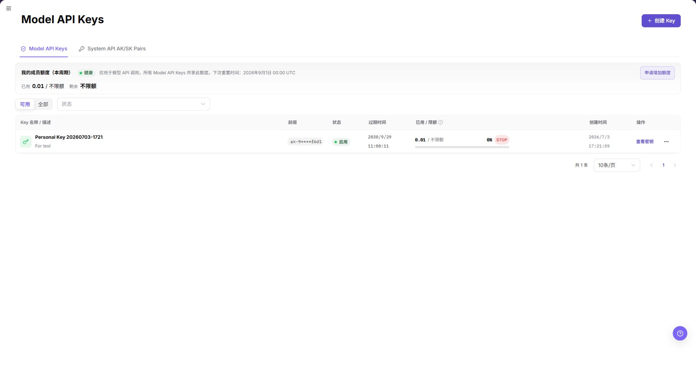
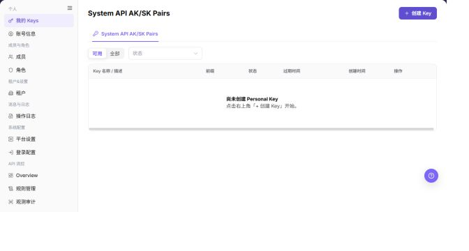
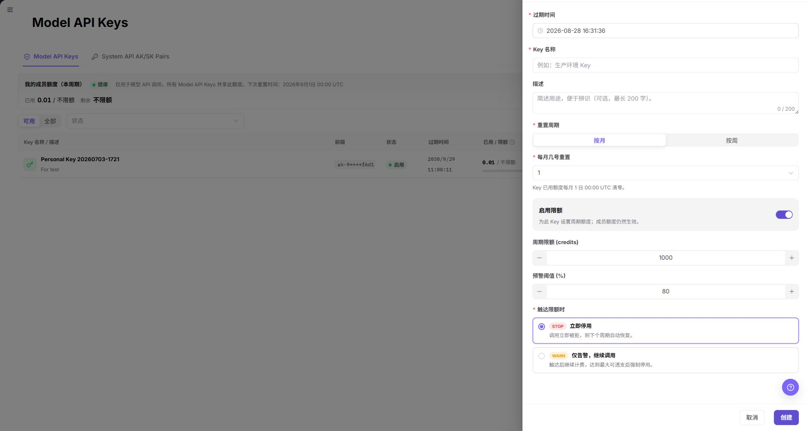
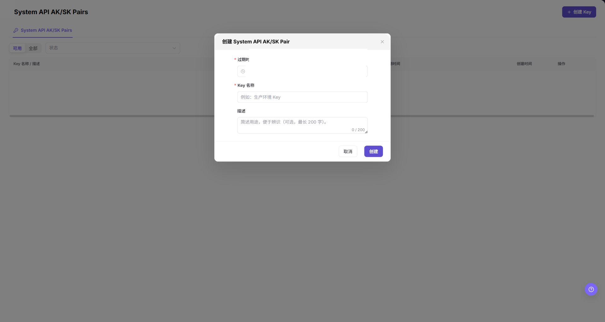
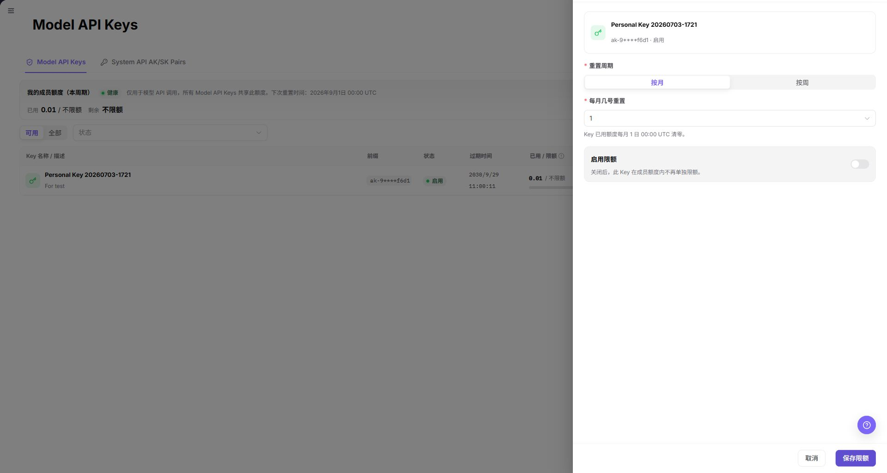

# 我的 Keys

## 功能概述

| 项目 | 内容 |
| --- | --- |
| 适用角色 | 模型调用方 |
| 导航路径 | 设置 > 个人 > 我的 Keys |
| 页面路由 | 从当前角色的可见菜单进入，不手工粘贴隐藏路由。 |
| 管理对象 | Model API Keys、System API AK/SK Pairs、状态、过期时间和适用的限额配置 |

#### 新手理解

每个应用或工作负载应使用独立凭据，并设置清晰的名称、过期计划，以及在 Model API 页面提供时与成员或项目策略一致的限额。完整 Key 或 AK/SK 对都属于敏感信息。

#### 术语速查

| 术语 | 英文 | 说明 |
| --- | --- | --- |
| Model API Key | Term | 用于调用模型 API 的凭据。；不同工作负载使用不同 Key。 |
| System API AK/SK Pair | Term | 用于调用系统 API 的访问标识和密钥对。；不要把完整凭据写入文档或前端代码。 |
| 成员额度 | Term | 当前周期内账号的 Model API Keys 共享额度。；排查额度错误时先核对。 |
| Key 限额 | Term | 页面提供时，可为单个 Key 设置的周期限额。；与项目或成员额度策略保持一致。 |

## 前提条件

1. 当前 Provider 或 End User 账号能看到 `设置 > 个人 > 我的 Keys`。
2. 打开创建或限额窗口前，已明确调用方、用途、过期时间和限额策略。
3. 轮换或停用 Key 前，已确认依赖该 Key 的调用方。

## 页面说明

个人页面的 Model API 页签展示成员额度概览、`可用` / `全部` 范围按钮、`状态` 筛选和凭据列表。列表展示 Key 名称 / 描述、前缀、状态、过期时间、已用 / 限额、创建时间和行内操作。`System API AK/SK Pairs` 使用相同筛选，但不显示成员额度概览和 `已用 / 限额` 列。

| 区域 | 说明 |
| --- | --- |
| 顶部按钮 | `创建 Key`，用于打开凭据创建窗口。 |
| 页签 | 当前角色允许时显示 `Model API Keys` 和 `System API AK/SK Pairs`。 |
| 成员额度 | Model API 页签展示当前周期的健康状态、已用、剩余、总额度和下次重置时间；`申请增加额度` 会打开额度申请页面。 |
| 筛选 | `可用` / `全部` 和 `状态`。 |
| 表格列 | Key 名称 / 描述、前缀、状态、过期时间、已用 / 限额、创建时间和操作。 |
| 行内操作 | 列表直接显示 `查看密钥`；更多菜单当前包含 `查看详情`、`编辑信息`、`延长有效期`、`限额`、`轮换` 和 `停用`。 |

截图保留左侧导航和完整功能区，顶部菜单已隐藏；请重点查看我的 Keys页面的字段、按钮和操作位置。

## 主要操作

### 查看 Model API Keys

1. 从可见菜单进入 `设置 > 个人 > 我的 Keys`。
2. 页签可见时，选择 `Model API Keys` 或 `System API AK/SK Pairs`。
3. 查看 Key 名称 / 描述、前缀、状态、过期时间、已用 / 限额、创建时间和当前可用的行内操作。
4. 对 Model API Key，打开更多菜单核对 `查看详情`、`编辑信息`、`延长有效期`、`限额`、`轮换` 和 `停用`；只读核查时不执行写操作。

截图保留左侧导航和完整功能区，顶部菜单已隐藏；请重点查看我的 Keys页面的字段、按钮和操作位置。

**结果校验：** 列表、详情和状态字段能够显示目标对象，且信息相互一致。

**注意事项：** 只使用当前页面实际展示的字段和入口，不根据其他角色页面推断能力。

**常见问题：** 如果入口不可见、按钮置灰或结果未更新，先检查当前账号权限、筛选条件、对象状态和页面刷新时间。

### 打开 Model API Key 创建窗口

1. 单击 **"创建 Key"**。
2. 查看必填的 `过期时间`、`Key 名称` 和可选的 `描述` 字段；`描述` 最长 200 个字符。
3. 选择必填的 `重置周期`；选择 `按月` 时核对 `每月几号重置`。
4. 页面提供 `启用限额` 时，决定是否设置 `周期限额 (credits)` 和 `预警阈值 (%)`。
5. 查看窗口中的触达限额处理策略，并再次确认调用方、用途、过期时间和限额方案。
6. 文档核查或截图时单击 **"取消"**，不要单击最终 `创建`。

**结果校验：** 按页面成功提示，并回到列表或详情核对对象状态、更新时间和影响范围。

**注意事项：** 提交前再次核对目标对象和影响范围；涉及权限、状态、数据或外部配置时，先确认审批和回退方式。

**常见问题：** 如果入口不可见、按钮置灰或结果未更新，先检查当前账号权限、筛选条件、对象状态和页面刷新时间。

### 打开 System API 密钥创建窗口

1. 选择 `System API AK/SK Pairs`。
2. 单击 **"创建 Key"**。
3. 查看必填的 `过期时间`、`Key 名称` 和可选的 `描述` 字段；`描述` 最长 200 个字符。
4. 确认该窗口没有 Model API 的额度、重置周期、预警阈值或触限策略字段。
5. 文档核查时单击 **"取消"**，不要单击最终 `创建`。

**结果校验：** 按页面成功提示，并回到列表或详情核对对象状态、更新时间和影响范围。

**注意事项：** 提交前再次核对目标对象和影响范围；涉及权限、状态、数据或外部配置时，先确认审批和回退方式。

**常见问题：** 如果入口不可见、按钮置灰或结果未更新，先检查当前账号权限、筛选条件、对象状态和页面刷新时间。

### 提交额度申请

1. 在 `Model API Keys` 页签单击 **"申请增加额度"**。
2. 确认页面进入 `设置 > 成员与角色 > 额度申请`。
3. 只查看申请记录和调整记录；未获得明确授权时，不提交最终额度申请。

截图保留左侧导航和完整功能区，顶部菜单已隐藏；请重点查看我的 Keys页面的字段、按钮和操作位置。

**结果校验：** 按页面成功提示，并回到列表或详情核对对象状态、更新时间和影响范围。

**注意事项：** 提交前再次核对目标对象和影响范围；涉及权限、状态、数据或外部配置时，先确认审批和回退方式。

**常见问题：** 如果入口不可见、按钮置灰或结果未更新，先检查当前账号权限、筛选条件、对象状态和页面刷新时间。

### 调整 Model API Key 限额

1. 打开目标 Model API Key 的更多菜单并选择 `限额`。
2. 查看 `重置周期`、`每月几号重置` 和 `启用限额` 状态。
3. `启用限额` 开启时，将页面显示的周期限额和预警阈值与项目或成员策略核对。
4. 未获得明确修改授权时，停在 `取消`，不要单击 **"保存限额"**。

**结果校验：** 按页面成功提示，并回到列表或详情核对对象状态、更新时间和影响范围。

**注意事项：** 提交前再次核对目标对象和影响范围；涉及权限、状态、数据或外部配置时，先确认审批和回退方式。

**常见问题：** 如果入口不可见、按钮置灰或结果未更新，先检查当前账号权限、筛选条件、对象状态和页面刷新时间。

## 参数速查表

| 字段名称 | 是否必填 | 字段类型 | 示例 | 说明 |
| --- | --- | --- | --- | --- |
| 过期时间 | 是 | 日期时间 | `2026-12-31 23:59` | 设置两种凭据的失效时间。 |
| Key 名称 | 是 | 文本 | `Production inference` | 用于识别两种凭据的工作负载或调用方。 |
| 描述 | 否 | 多行文本 | `Backend inference job` | 两种凭据均可填写的用途说明；页面显示最长 200 个字符。 |
| 重置周期 | 是 | 枚举 | `按月` | 仅适用于 Model API Key，用于控制 Key 用量重置周期。 |
| 每月几号重置 | 条件必填 | 枚举 / 数字 | `1` | 选择 `按月` 时显示。 |
| 启用限额 | 否 | 开关 | 开启 | 为单个 Key 启用周期限额；成员额度仍然生效。 |
| 周期限额 (credits) | 条件必填 | 数字 | `1000` | 启用限额后的单 Key 周期额度。 |
| 预警阈值 (%) | 条件必填 | 数字 | `80` | 创建窗口显示的额度预警阈值。 |
| 触达限额策略 | 条件必填 | 枚举 | `停止` | 定义达到已配置限额后的处理方式。 |
| 前缀 | 系统生成 | 文本 | `已脱敏前缀` | 列表中的非敏感识别信息。 |
| 状态 | 系统生成 | 枚举 | `启用` | 表示凭据当前是否可用。 |
| 已用 / 限额 | 系统生成 | 用量 | `已脱敏 / 限额` | 显示当前 Key 用量与适用限额。 |
| 创建时间 | 系统生成 | 日期 | `已脱敏日期` | 记录 Key 创建时间。 |
| 操作 | 系统生成 | 按钮 / 菜单 | `查看详情` | 提供 `查看密钥` 和当前凭据、状态允许的更多操作。 |

## 踩坑提示

- 页签和行内操作取决于角色与租户。只使用从当前账号可见菜单进入后实际显示的控件。
- 打开窗口不等于创建或保存凭据。文档核查时停在 `取消`。
- 某类凭据的当前 Demo 页面没有显示权限范围、额度、重置周期或预警字段时，不要把这些字段补写到该凭据类型中。
- 不要把完整 Key、AK/SK、Token、名称、标识、真实用量或日期写入文档、工单或截图。

## 结果校验

| 检查项 | 成功表现 | 异常时处理 |
| --- | --- | --- |
| 页面入口 | 可从 `设置 > 个人 > 我的 Keys` 打开页面。 | 检查当前角色、租户和菜单权限。 |
| 页签可见性 | 当前账号能看到预期的凭据页签。 | 不推断隐藏路由，记录该页签不可用。 |
| 列表状态 | 列表展示文档中的字段和当前可用的行内操作。 | 检查筛选条件和凭据状态。 |
| 创建窗口 | 可见的必填和可选字段与当前页签一致。 | 停止编辑手册，重新核对 Demo 页面。 |
| 额度申请 | `申请增加额度` 打开 `设置 > 成员与角色 > 额度申请`。 | 重新从可见菜单进入，并记录导航不一致。 |
| 限额窗口 | 更多菜单中的 `限额` 打开重置和限额配置。 | 记录该入口受凭据类型或状态限制。 |

## 常见问题

#### Key 调用失败

**问题现象：** 接口返回认证或额度错误。

**处理方式：** 核对 Key 状态、过期时间、成员额度、项目策略和单 Key 限额；轮换或停用前通知依赖调用方。

#### 为什么找不到目标 Key？

**问题现象：** 列表中没有目标 Key。

**处理方式：** 确认当前凭据页签，在 `可用` 和 `全部` 间切换，清空状态筛选，并核对当前账号和项目范围。

#### 为什么创建、限额、轮换或停用不可用？

**问题现象：** 页面可见，但某个操作缺失或不可点击。

**处理方式：** 该操作可能取决于角色、租户策略、Key 状态或当前凭据类型。以当前账号可见菜单和行状态为准。

#### 如何安全导出或截图我的 Keys页面？

**问题现象：**

需要把页面信息用于排障、审计或交付。

**可能原因：**

页面可能包含账号、邮箱、IP、内部路径、租户标识、Key 或金额等敏感信息。

**处理方式：**

只保留必要字段和操作上下文，使用浅灰小颗粒马赛克覆盖敏感文字，不外发完整凭证或内部地址。

#### 我的 Keys页面出现异常数据怎么办？

**问题现象：**

字段、状态、统计或关联对象与预期不一致。

**可能原因：**

页面范围、时间条件、角色权限或上游配置不一致。

**处理方式：**

记录脱敏后的对象、时间和结果，先核对页面入口及筛选条件，再查看关联页面和操作日志。

## 注意事项

- 不要在文档、截图或聊天中暴露完整 Key、AK/SK、Token 或私钥。
- `创建`、`保存限额`、`轮换` 和 `停用` 会影响实际调用；执行任何获准的修改前必须确认业务影响。

## 后续操作

1. 回到设置 > 个人 > 我的 Keys核对本次操作的状态和更新时间。
2. 如需继续处理关联对象，进入页面提供的下一个业务入口。
