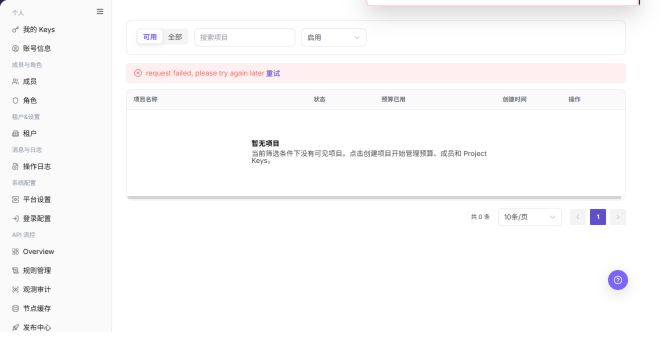

# 项目

## 功能概述

| 项目 | 内容 |
| --- | --- |
| 适用角色 | 模型调用方 |
| 导航路径 | 设置 > 个人 > 项目 |
| 页面路由 | `/user/user-space/projects` |
| 管理对象 | 项目、项目状态、预算已用、创建时间和项目详情 |

#### 新手理解

项目页像服务商账号的项目账本，用来查看项目名称、预算、模型数量和成员归属，帮助判断调用失败是否与项目状态或预算有关。

#### 术语速查

| 术语 | 英文 | 说明 |
| --- | --- | --- |
| 项目 | Project | 承载模型调用、预算和成员协作的业务空间。；创建或排障前先确认项目归属。 |
| 项目预算 | Term | 项目可使用额度或金额上限。；达到上限时会影响调用。 |
| 模型数量 | Term | 项目下关联或可用模型数量。；异常时检查模型授权。 |
| 成员 | Member | 项目内可协作的账号。；权限问题时核对成员角色。 |

## 前提条件

1. 当前账号具备项目查看权限。
2. 创建项目之前，已确定项目名称、预算周期和超预算策略。
3. 如启用模型白名单，已明确允许调用的模型范围。

## 页面说明

| 区域 | 说明 |
| --- | --- |
| 顶部按钮 | `创建项目` |
| 筛选项 | 搜索项目、可用状态 |
| 表格列 | 项目名称、状态、预算已用、创建时间、操作 |
| 行内按钮 | 查看、归档 |
| 详情页签 | 概览、成员、用量、API Keys、活动、设置 |

截图保留左侧导航和完整功能区，顶部菜单已隐藏；请重点查看项目页面的字段、按钮和操作位置。

## 主要操作

### 查看项目

1. 进入 `设置 > 个人 > 项目`。
2. 按项目名称、状态、成员或更新时间筛选。
3. 打开详情，核对成员、额度、默认配置和状态。
4. 无结果时重置筛选并确认租户上下文；项目信息外发前必须脱敏。

截图保留左侧导航和完整功能区，顶部菜单已隐藏；请重点查看项目页面的字段、按钮和操作位置。

**结果校验：** 列表、详情和状态字段能够显示目标对象，且信息相互一致。

**注意事项：** 只使用当前页面实际展示的字段和入口，不根据其他角色页面推断能力。

**常见问题：** 如果入口不可见、按钮置灰或结果未更新，先检查当前账号权限、筛选条件、对象状态和页面刷新时间。

### 创建项目

1. 点击 **"创建项目"**。
2. 核对名称、成员、额度和默认配置。
3. 保存前确认配额和成员范围；只读核验时关闭表单，不提交。
4. 获批保存后在列表和详情核验新状态；失败时检查名称唯一性、必填项和额度限制。

截图保留左侧导航和完整功能区，顶部菜单已隐藏；请重点查看项目页面的字段、按钮和操作位置。

**结果校验：** 按页面成功提示，并回到列表或详情核对对象状态、更新时间和影响范围。

**注意事项：** 提交前再次核对目标对象和影响范围；涉及权限、状态、数据或外部配置时，先确认审批和回退方式。

**常见问题：** 如果入口不可见、按钮置灰或结果未更新，先检查当前账号权限、筛选条件、对象状态和页面刷新时间。

### 编辑项目

1. 进入 `设置 > 个人 > 项目`。
2. 使用搜索框或状态筛选定位项目。
3. 查看项目名称、状态、预算已用和创建时间。

下图展示项目列表，筛选项位于列表上方，操作按钮位于表格右侧。

4. 单击 **"创建项目"** 打开创建项目表单。
5. 填写项目名称、描述、重置周期、周期预算、预算预警阈值、超预算策略和模型白名单。
6. 确认影响范围后再单击 **"创建"**。

下图展示创建项目表单。

7. 在列表中单击 **"查看"** 进入项目详情。
8. 在详情页切换概览、成员、用量、API Keys、活动、设置页签查看项目配置。

下图展示项目详情页。

**结果校验：** 按页面成功提示，并回到列表或详情核对对象状态、更新时间和影响范围。

**注意事项：** 提交前再次核对目标对象和影响范围；涉及权限、状态、数据或外部配置时，先确认审批和回退方式。

**常见问题：** 如果入口不可见、按钮置灰或结果未更新，先检查当前账号权限、筛选条件、对象状态和页面刷新时间。

### 查看项目详情

1. 进入 `设置 > 个人 > 项目`。
2. 定位目标项目，点击 **"查看"**。
3. 按页面显示的必填字段完成查看或填写，并核对目标对象、影响范围和当前状态。
4. 对会改变数据、权限、状态或外部配置的操作，确认影响范围和回退方式后再点击最终确认按钮。
5. 操作完成后返回列表或详情页，核对状态、更新时间或结果提示。

截图保留左侧导航和完整功能区，顶部菜单已隐藏；请重点查看项目页面的字段、按钮和操作位置。

**结果校验：** 列表、详情和状态字段能够显示目标对象，且信息相互一致。

**注意事项：** 只使用当前页面实际展示的字段和入口，不根据其他角色页面推断能力。

**常见问题：** 如果入口不可见、按钮置灰或结果未更新，先检查当前账号权限、筛选条件、对象状态和页面刷新时间。

## 参数速查表

| 字段名称 | 是否必填 | 字段类型 | 示例 | 说明 |
| --- | --- | --- | --- | --- |
| 项目名称 | 否 | 文本 | 示例项目 A | 用于识别项目。 |
| 预算 | 否 | 额度 | 10,000 Credits | 用于控制项目可用额度。 |
| 模型数量 | 否 | 数值 | 5 | 展示项目关联模型数量。 |
| 项目状态 | 否 | 枚举 | 启用 | 展示项目是否可继续使用。 |
| 成员 | 否 | 列表 | 示例成员 A | 展示项目成员范围。 |

## 踩坑提示

- 项目预算达到上限时，Key 正常也可能调用失败。
- 项目名称相似时不要只凭名称判断，应结合成员和预算确认。
- 项目成员变化可能影响调用权限，排查时要确认角色和成员范围。

## 结果校验

| 检查项 | 成功表现 | 异常时处理 |
| --- | --- | --- |
| 项目已创建 | 新项目出现在项目列表中 | 刷新列表并检查创建结果提示 |
| 详情完整 | 项目详情页显示预算、剩余 Credits、策略和趋势信息 | 重新打开项目详情并确认是否有查看权限 |
| 页签可用 | 成员、用量、API Keys、活动、设置页签可以正常切换 | 检查项目角色权限和页面加载状态 |

## 常见问题

#### 项目达到预算后无法调用

**问题现象：**

项目调用被阻断或显示额度不足。

**可能原因：**

- 项目超预算策略为 `STOP`。
- 周期预算已耗尽。
- 项目未到下次重置时间。

**处理方式：**

1. 进入项目详情查看预算已用比例。
2. 按需调整预算或策略。
3. 检查项目 Key 是否仍处于启用状态。

#### 项目列表为什么没有目标项目？

**问题现象：**

项目页没有显示预期项目，或只能看到部分项目。

**可能原因：**

当前账号不是项目成员，项目被停用或归属到其他租户，也可能是项目名称、状态筛选限制了范围。

**处理方式：**

清空筛选后重新查询；确认当前租户和项目成员关系；仍不可见时请项目管理员检查项目状态和授权。
#### 为什么项目创建或设置按钮不可用？

**问题现象：**

项目列表可见，但新增项目、编辑预算、配置成员或管理 API Keys 的入口不可点击。

**可能原因：**

当前账号不是项目管理员，租户关闭了自助建项目，或项目处于停用、冻结状态。

**处理方式：**

确认项目角色和租户项目策略；需要变更时由项目管理员或租户管理员处理，并在项目详情中核对结果。

#### 如何安全导出或截图项目页面？

**问题现象：**

需要把页面信息用于排障、审计或交付。

**可能原因：**

页面可能包含账号、邮箱、IP、内部路径、租户标识、Key 或金额等敏感信息。

**处理方式：**

只保留必要字段和操作上下文，使用浅灰小颗粒马赛克覆盖敏感文字，不外发完整凭证或内部地址。

#### 项目页面出现异常数据怎么办？

**问题现象：**

字段、状态、统计或关联对象与预期不一致。

**可能原因：**

页面范围、时间条件、角色权限或上游配置不一致。

**处理方式：**

记录脱敏后的对象、时间和结果，先核对页面入口及筛选条件，再查看关联页面和操作日志。

## 注意事项

- `归档` 会影响项目后续使用，执行前应确认项目不再承载调用。
- 创建项目时不要把客户敏感信息写入项目名称或描述。

## 后续操作

1. 在项目详情中维护成员和 API Keys。
2. 查看项目用量和活动记录。
3. 根据业务需要调整预算、白名单和超预算策略。
